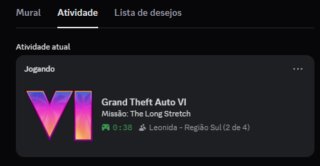

# 🌴 GTA VI Discord Rich Presence

Simulador de status "Jogando Grand Theft Auto VI" para Discord. 
Este projeto permite exibir uma presença rica customizada no seu perfil, alternando entre estados como "Explorando Vice City" ou "Em Missão".



## 🚀 Funcionalidades

- **Rotação de Status:** Alterna automaticamente entre diferentes atividades no jogo.
- **Botões Clicáveis:** Links diretos para o trailer ou site oficial.
- **Timer:** Mostra "Jogando há X minutos".
- **Leve:** Roda em segundo plano consumindo recursos mínimos.

## 🛠️ Instalação (Usuário Final)

1. Vá até a aba [Releases](../../releases) deste repositório.
2. Baixe o arquivo `GTAVI-RPC.exe`.
3. Abra seu Discord no PC.
4. Execute o arquivo `.exe`.
5. **Pronto!** Verifique seu perfil.

## 💻 Para Desenvolvedores

### Pré-requisitos
- Node.js 18+
- Conta no Discord Developer Portal

### Configuração

1. Clone o repositório:
   ```bash
   git clone https://github.com/SEU-USUARIO/gta6-rpc.git
   cd gta6-rpc
   ```

2. Instale as dependências:
   ```bash
   npm install
   ```

3. Configure as variáveis de ambiente:
   Crie um arquivo `.env` na raiz do projeto e adicione seu Client ID:
   ```env
   CLIENT_ID=seu_id_do_discord_developer_portal
   ```

4. Rode em modo de desenvolvimento:
   ```bash
   npm start
   ```

### Build (Gerar Executável)
Para criar o `.exe` localmente:

```bash
npm run build
```

O arquivo será gerado na pasta `build/`.

## 📄 Licença
Distribuído sob a licença MIT. Veja [LICENSE](LICENSE) para mais informações.

**Aviso Legal:** Este projeto não é afiliado à Rockstar Games. É um projeto de fã para fins estéticos e educacionais.